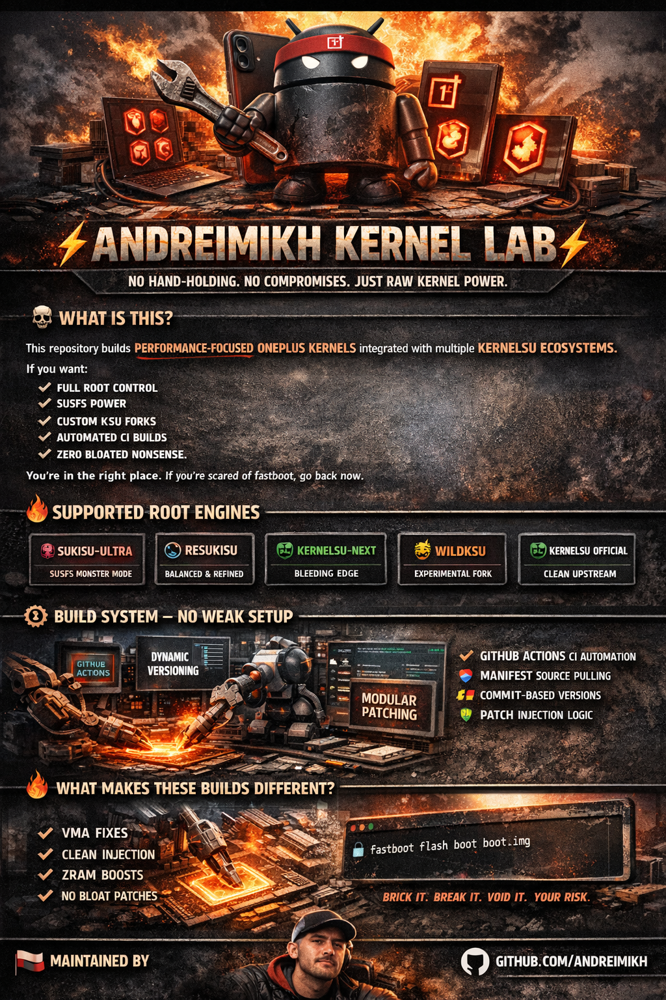

  

 

⚡ ANDREIMIKH KERNEL LAB ⚡

No Hand-Holding, No Compromises, Just Raw Kernel Power

💀 What Is This?

This Repository Builds Performance-Focused OnePlus Kernels Integrated With Multiple KernelSU Eco-Systems

If You Want:

Full Root Control

SUSFS Power

Custom KSU Forks

Automated CI Builds

Clean Version Injection

Zero Bloated Non-Sense

You're In The Right Place

If You're Scared Of Fastboot, Go Back Now

🔥 Supported Root Engines

This Kernel Can Be Built With:

🟣 SukiSU-Ultra – SUSFS Monster Mode

🔵 ReSukiSU – Balanced and Refined

🟢 KernelSU-Next – Bleeding Edge

🟡 WildKSU – Experimental Fork

🔴 KernelSU (Official) – Clean Upstream

You Choose Your Weapon At Build Time

🧠 Core Philosophy

Performance > Safety Nets

Automation > Manual Mess

Power Users > Casual Flashers

Reproducible Builds > Telegram Prebuilts

No Mystery Binaries
No Hidden Patches
Everything Is Automated - Everything Is Visible

⚙️ Build System – No Weak Setup

This Repository Runs:

🚀 GitHub Actions CI Automation

🧩 Manifest-Based Source Pulling

🧮 Commit-Based Dynamic Version Injection

🛡 Auto-Detect SUSFS Header Parsing

🔧 Patch Injection (Official / Fallback Logic)

🧠 Modular Toggles:

SUSFS

ZRAM

LZ4KD

KSU META Switch

🧬 Kernel Versioning Logic

We Don’t Hardcode Lazy Version Numbers

KSU_VERSION=$(( $(git rev-list --count main) + OFFSET ))

Each KSU Fork Has Its Own Offset

Why?

So Versions Never Collide
So Managers Don’t Misread Builds
So the Ecosystem Stays Clean

🧨 What Makes These Builds Different?

✔ VMA Compatibility Fixes (When SUSFS Requires It)
✔ Proper Symbol Handling
✔ Clean Driver Injection
✔ KernelSU Full Name Formatting (ReSukiSU Compatible)
✔ ZRAM Enhancement Support
✔ LZ4KD Performance Compression
✔ Multi-Manifest Selectable Builds
✔ Zero Telegram-Only Patches

This Is Structured, Not Random Patch Stacking

🛠 Workflow Inputs

You Control Everything From GitHub Actions:

Input	Meaning
FILE	        Select Target Manifest
KSU META	    Select Root Engine
SUSFS META	  Enable/Disable SUSFS
ZRAM	Enable  ZRAM Optimization

Full Modular Control, No Fork Needed

💣 Installation

You Should Already Know What You’re Doing

"fastboot flash boot boot.img"

If This Scares You — Stop Here

⚠ Reality Check

Flashing Custom Kernels Can:

Brick Your Device

Break SafetyNet

Void Warranty

Cause Instability

You Chose This Life

🧪 Target Users

ROM Developers

Kernel Hackers

Advanced Root Users

People Who Understand Logs

People Who Read Commit History

Not For Casual Users Asking “How To Root?”

🏴 Maintained By

Andrei Mikh
Kernel Builder • Automation Addict • OnePlus Tweaker

Philippines 🇵🇭

GitHub: https://github.com/AndreiMikh

⭐ Final Note

This Repository Exists For Control!

You Control:

The Root System

The Patch Stack

The Version Logic

The Automation

No Middle Layer
No Pre-Built Dependency Chains
No Non-Sense
